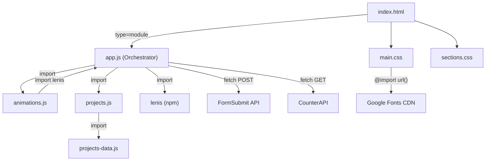

# EXPLAIN.md — Akshaysinh Rajput Portfolio Website

> **Complete Technical Knowledge Base**
> Last analyzed: August 12, 2026
> Codebase version: `1.0.0`

---

## Table of Contents

- [1. Project Identification](#1-project-identification)
- [2. Executive Summary](#2-executive-summary)
- [3. Complete Project Structure](#3-complete-project-structure)
- [4. Architecture](#4-architecture)
- [5. Technology Stack](#5-technology-stack)
- [6. Entry Points](#6-entry-points)
- [7. Core Modules](#7-core-modules)
- [8. Data Flow](#8-data-flow)
- [9. Frontend / UI](#9-frontend--ui)
- [10. External Services & Integrations](#10-external-services--integrations)
- [11. State Management & Caching](#11-state-management--caching)
- [12. Authentication & Authorization](#12-authentication--authorization)
- [13. Security Analysis](#13-security-analysis)
- [14. Error Handling](#14-error-handling)
- [15. Performance Analysis](#15-performance-analysis)
- [16. Accessibility](#16-accessibility)
- [17. SEO Implementation](#17-seo-implementation)
- [18. Theme System](#18-theme-system)
- [19. Animation System](#19-animation-system)
- [20. Testing](#20-testing)
- [21. Build System](#21-build-system)
- [22. CI/CD Pipeline](#22-cicd-pipeline)
- [23. Configuration & Environment Variables](#23-configuration--environment-variables)
- [24. Dependencies](#24-dependencies)
- [25. Deployment](#25-deployment)
- [26. Local Development](#26-local-development)
- [27. Important User / Business Flows](#27-important-user--business-flows)
- [28. Scalability](#28-scalability)
- [29. Code Quality](#29-code-quality)
- [30. Legacy / Unused / Suspicious Files](#30-legacy--unused--suspicious-files)
- [31. Known Issues](#31-known-issues)
- [32. Limitations](#32-limitations)
- [33. Architectural Decisions](#33-architectural-decisions)
- [34. Future Roadmap](#34-future-roadmap)
- [35. Important File Index](#35-important-file-index)
- [36. Glossary](#36-glossary)
- [37. Final System Summary](#37-final-system-summary)

---

## 1. Project Identification

| Attribute | Value |
| :--- | :--- |
| **Project Name** | `portfolio-akshaysinh` |
| **Project Type** | Static personal portfolio website (Single-Page Application) |
| **Primary Purpose** | Showcase the professional profile, skills, projects, and contact information of Akshaysinh Rajput |
| **Main Problem Solved** | Provides a centralized, interactive, and visually rich web presence for a developer seeking freelance and full-time opportunities |
| **Intended Users** | Potential employers, freelance clients, recruiters, and professional network contacts |
| **Primary Language** | JavaScript (ES6+ Modules), HTML5, CSS3 |
| **Architecture Style** | Single-page static site with modular ES6 JavaScript |
| **Deployment Model** | Static hosting, verified at `https://www.portfolioakshay.in/` |
| **Live URL** | [portfolioakshay.in](https://www.portfolioakshay.in/) |
| **Repository Owner** | Akshaysinh Rajput (`ra901625072-boop` on GitHub) |

---

## 2. Executive Summary

This project is a **premium, single-page portfolio website** for Akshaysinh Rajput, a Python & Full-Stack Developer and MCA student based in Gujarat, India. The site is built with **vanilla HTML, CSS, and JavaScript** (no UI framework like React or Vue), bundled with **Vite** for development and production builds, and uses the **Lenis** library for smooth scrolling.

### What It Does
- Presents a personal brand with a hero section featuring dynamic typing effects and 3D parallax avatar
- Showcases 5 portfolio projects with detailed interactive case study modals
- Displays skills, services, experience timeline, and achievements
- Provides a contact form (powered by FormSubmit API) and visitor counter (powered by CounterAPI)
- Implements a full dark/light theme system with circular reveal transitions using the View Transitions API

### Key Technical Highlights
- **Zero-framework frontend** — pure HTML/CSS/JS with ES Modules
- **Physics-based custom cursor** with magnetic snapping and LERP interpolation
- **Interactive blueprint/wireframe HUD** in the hero section with crosshair tracking
- **Scroll-driven timeline progress** with dot illumination
- **3D card tilt effects** with spotlight glow tracking
- **View Transitions API** circular ripple theme switching
- **Preloader with FLIP animation** that transfers logo from preloader to navigation
- **Content-visibility optimization** for offscreen section rendering
- **Full accessibility support** with ARIA attributes, keyboard navigation, skip links, focus trapping, and `prefers-reduced-motion` respect

### Project Maturity
The project is in a **production-ready state**, actively deployed at `portfolioakshay.in`, with a CI/CD verification pipeline, comprehensive SEO implementation (Open Graph, Twitter Cards, JSON-LD structured data), and polished visual design.

---

## 3. Complete Project Structure

```
portfolio/
├── .github/
│   └── workflows/
│       └── verify.yml                    # CI pipeline: lint + build verification
├── assets/
│   ├── css/
│   │   ├── main.css                      # Global design system, variables, typography, utilities (21 KB)
│   │   └── sections.css                  # Section-specific styles, components, responsive (86 KB)
│   └── js/
│       ├── app.js                        # Main application entry point & orchestrator (47 KB)
│       ├── data/
│       │   └── projects-data.js          # Structured project & achievement data (19 KB)
│       └── modules/
│           ├── animations.js             # All animation systems: cursor, reveals, parallax (26 KB)
│           └── projects.js               # Project rendering, filtering, modal, achievements (15 KB)
├── dist/                                 # Production build output (generated)
│   ├── assets/
│   │   ├── docs/                         # Copied resume files
│   │   ├── images/                       # Copied image assets
│   │   ├── index-CH87loyV.css            # Bundled & minified CSS (80 KB)
│   │   └── index-Cn8cnAjw.js             # Bundled & minified JS (84 KB)
│   └── index.html                        # Production HTML
├── github-readmes/                       # Portfolio project README documentation
│   ├── CBDC-README.md                    # Pali CBDC Portal documentation
│   ├── FamDoc-README.md                  # Family Document Manager documentation
│   ├── Glossary-Mart-README.md           # e-Grossary Mart documentation
│   ├── Jarvis-README.md                  # Multi-Agent Automation documentation
│   ├── Resume-Maker-README.md            # Resume Maker documentation
│   └── ra901625072-boop-README.md        # GitHub profile README
├── public/
│   └── assets/
│       ├── docs/
│       │   ├── resume.html               # Interactive SVG-based resume with theme support (17 KB)
│       │   └── resume.pdf                # Downloadable PDF resume (83 KB)
│       └── images/
│           ├── avatar.png                # Developer avatar photograph (168 KB)
│           ├── cbdc-pali.png             # CBDC Portal project screenshot (322 KB)
│           ├── e-grossary.png            # e-Grossary Mart screenshot (804 KB)
│           ├── famdoc.png                # FamDoc project screenshot (128 KB)
│           ├── favicon.svg               # SVG favicon with gradient "A" letter
│           ├── multi-agent-automation.jpg # Jarvis project screenshot (682 KB)
│           └── resume-maker.png          # Resume Maker screenshot (1.1 MB)
├── node_modules/                         # NPM dependencies (generated)
├── .gitignore                            # Excludes node_modules, dist, .env*, IDE files
├── .prettierrc                           # Prettier formatting rules
├── index.html                            # Main application HTML (43 KB, 744 lines)
├── package.json                          # NPM configuration & scripts
├── package-lock.json                     # Dependency lockfile
├── README.md                             # Project documentation
├── robots.txt                            # Search engine crawler rules
├── sitemap.xml                           # XML sitemap for SEO
└── vite.config.js                        # Vite build configuration
```

### Key Directories

| Path | Purpose | Responsibilities |
| :--- | :--- | :--- |
| `assets/css/` | Design system | All CSS variables, theme definitions, component styles, animations, responsive breakpoints |
| `assets/js/` | Application logic | Module orchestration, animation engine, data management, project rendering |
| `assets/js/data/` | Content data store | Structured project and achievement data as ES module exports |
| `assets/js/modules/` | Feature modules | Encapsulated animation and project/modal functionality |
| `public/` | Static assets | Images, documents, favicon — copied as-is to `dist/` during build |
| `public/assets/docs/` | Resume documents | Interactive HTML resume and downloadable PDF |
| `public/assets/images/` | Media assets | Project screenshots, avatar, favicon |
| `github-readmes/` | Reference documentation | Detailed README files for each portfolio project (not served on the site) |
| `dist/` | Build output | Vite-generated production bundle (minified CSS/JS, optimized assets) |
| `.github/workflows/` | CI/CD | GitHub Actions workflow for automated build verification |

---

## 4. Architecture

This project follows a **modular static site architecture** with clear separation of concerns:

```
┌────────────────────────────────────────────────────────────────┐
│                        Browser (Client)                        │
├────────────────────────────────────────────────────────────────┤
│                                                                │
│  index.html ─── Single-page document                          │
│       │                                                        │
│       ├── assets/css/main.css ────── Design system & tokens    │
│       ├── assets/css/sections.css ── Component & section CSS   │
│       │                                                        │
│       └── assets/js/app.js ──────── Orchestrator (ES Module)   │
│              │                                                  │
│              ├── modules/animations.js ── Animation engine     │
│              │       └── imports lenis from app.js              │
│              │                                                  │
│              ├── modules/projects.js ─── Project/modal system  │
│              │       └── imports data/projects-data.js          │
│              │                                                  │
│              └── data/projects-data.js ── Content database     │
│                                                                │
│  External Services:                                            │
│    ├── FormSubmit API ──── Contact form submissions            │
│    ├── CounterAPI ──────── Visitor counter tracking            │
│    └── Google Fonts CDN ── Typography (Space Grotesk, Inter)  │
│                                                                │
│  Static Assets:                                                │
│    ├── public/assets/docs/resume.html ── Embedded iframe      │
│    ├── public/assets/docs/resume.pdf ─── Download target      │
│    └── public/assets/images/ ─────────── Screenshots/avatar   │
│                                                                │
└────────────────────────────────────────────────────────────────┘
```

### Module Dependency Graph



### Architectural Pattern
- **Modular ES Module Architecture**: The JavaScript is organized as a dependency tree of ES modules loaded natively by the browser via `<script type="module">`.
- **Data-Driven Rendering**: Project cards, achievements, and skill bars are rendered dynamically from structured data objects rather than being hardcoded in HTML.
- **Event-Driven Communication**: Modules communicate via custom DOM events (`"site-loaded"`, `"recalc-offsets"`) rather than direct function calls for loosely coupled coordination.
- **Progressive Enhancement**: The site degrades gracefully — touch devices skip the custom cursor, reduced-motion preferences disable animations, and cross-origin iframe failures have fallbacks.

---

## 5. Technology Stack

| Category | Technology | Version | Purpose | Evidence |
| :--- | :--- | :--- | :--- | :--- |
| **Language** | JavaScript (ES6+) | ES2020+ | Application logic, DOM manipulation, animations | `assets/js/` |
| **Language** | HTML5 | 5 | Document structure, semantic markup | `index.html` |
| **Language** | CSS3 | 3 | Styling, animations, responsive design | `assets/css/` |
| **Build Tool** | Vite | `^5.0.0` | Development server, HMR, production bundling | `package.json`, `vite.config.js` |
| **Smooth Scrolling** | Lenis | `^1.3.25` | High-performance smooth scroll engine | `package.json` |
| **Typography** | Google Fonts | — | Space Grotesk (headings), Inter (body) | `main.css` `@import` |
| **Code Formatter** | Prettier | — | Consistent code formatting | `.prettierrc` |
| **CI/CD** | GitHub Actions | — | Automated formatting check and build verification | `.github/workflows/verify.yml` |
| **Contact API** | FormSubmit | — | Serverless form submission via AJAX | `app.js` fetch call |
| **Analytics** | CounterAPI | — | Page visitor counting and persistence | `app.js` fetch call |
| **Bundler** | esbuild | — | Minification (used by Vite internally) | `vite.config.js` `minify: "esbuild"` |
| **Hosting** | Custom domain | — | Static site hosting at `portfolioakshay.in` | `sitemap.xml`, `robots.txt`, canonical URL |

---

## 6. Entry Points

### Primary Application Entry
| Attribute | Value |
| :--- | :--- |
| **Entry point** | Browser loads `index.html` |
| **File** | `index.html` (line 741) |
| **Script** | `<script type="module" src="assets/js/app.js">` |
| **Purpose** | Loads the main orchestrator module which initializes all subsystems |
| **What happens** | Lenis instantiated → scroll locked → `DOMContentLoaded` fires → preloader animation → 21-step initialization sequence → site becomes interactive |

### Development Server Entry
| Attribute | Value |
| :--- | :--- |
| **Entry point** | `npm run dev` |
| **Command** | `vite` |
| **Purpose** | Starts Vite dev server with HMR at `http://localhost:5173` |
| **What happens** | Vite serves `index.html` as root, resolves ES module imports, provides hot module replacement |

### Production Build Entry
| Attribute | Value |
| :--- | :--- |
| **Entry point** | `npm run build` |
| **Command** | `vite build` |
| **Purpose** | Generates optimized production bundle in `dist/` |
| **What happens** | CSS minified, JS minified via esbuild, assets copied from `public/`, output to `dist/` |

### Resume Document Entry
| Attribute | Value |
| :--- | :--- |
| **Entry point** | `public/assets/docs/resume.html` |
| **Purpose** | Standalone interactive SVG-based resume viewable in browser or embedded as iframe |
| **What happens** | Reads `?theme=light|dark` URL parameter, applies corresponding CSS class, renders SVG resume |

---

## 7. Core Modules

### 7.1 `app.js` — Application Orchestrator

| Attribute | Detail |
| :--- | :--- |
| **File** | `assets/js/app.js` (47 KB, ~1,200 lines) |
| **Purpose** | Central initialization hub that bootstraps all subsystems in correct order |
| **Responsibilities** | Lenis setup, preloader FLIP animation, theme management, scroll spy, contact form, visitor counter, mobile menu, avatar scroll animation, shimmer dismissal, navigation transitions |
| **Exports** | `lenis` (Lenis instance, consumed by `animations.js`) |
| **Dependencies** | `lenis` (npm), `./modules/projects.js`, `./modules/animations.js` |
| **External APIs** | FormSubmit (contact form), CounterAPI (visitor counter) |

**Key functions (30+ total):**
- `initPreloader(callback)` — Letter-by-letter reveal animation + FLIP logo transfer
- `runLogoTakeover()` — FLIP animation from preloader to header navigation logo
- `initTheme()` — View Transitions API circular reveal theme switching
- `initContactForm()` — Real-time validation + FormSubmit AJAX POST
- `initVisitorCounter()` — CounterAPI fetch + count-up animation + localStorage cache
- `initAvatarScrollAnimation()` — Scroll-driven 3D avatar flight from hero to header
- `initScrollSpy()` — IntersectionObserver for active navigation highlighting
- `initSkillsTabs()` — Dynamic SVG progress rings, tab switching, skill bar animations
- `showToast()` — Floating notification system with auto-dismiss timer
- `initNavTransitions()` — Page curtain transition on internal anchor navigation

### 7.2 `animations.js` — Animation Engine

| Attribute | Detail |
| :--- | :--- |
| **File** | `assets/js/modules/animations.js` (26 KB, 822 lines) |
| **Purpose** | All visual animation subsystems |
| **Responsibilities** | Custom cursor + magnetic snapping, scroll reveals, typing effect, timeline progress, designer grid HUD, watermark parallax, nav indicator pill, page transitions |
| **Exports** | `initAnimations()`, `animatePercentageText()`, `animateSkillsBars()`, `animateStatsCounters()`, `updateNavIndicator()`, `triggerPageTransition()` |
| **Dependencies** | Imports `lenis` from `../app.js` |

**Key subsystems:**
1. **Custom Cursor** (`initCustomCursor`) — Dual-element LERP cursor with self-pausing RAF loop, magnetic snapping to buttons/links, elastic spring release
2. **Scroll Reveals** (`initScrollReveals`) — IntersectionObserver for directional fade/slide animations
3. **TextTyper Class** — Typewriter engine cycling through hero title words with natural timing variation
4. **Avatar Parallax** (`initAvatarParallax`) — 3D perspective tilt on hero avatar card
5. **Timeline Highlight** (`initTimelineScrollHighlight`) — Scroll-driven progress line fill with dot illumination at 65% viewport trigger
6. **Designer Grid** (`initDesignerGrid`) — Interactive crosshair tracking, coordinate HUD, snap-to-target, background spotlight CSS variables
7. **Watermark Parallax** (`initWatermarkParallax`) — Background text parallax at 12% scroll velocity
8. **Nav Indicator** (`initNavIndicator`) — Sliding capsule pill tracking active/hovered navigation links
9. **Page Transition** (`triggerPageTransition`) — Full-screen curtain overlay with slide-in/out phases

### 7.3 `projects.js` — Project Rendering & Modal System

| Attribute | Detail |
| :--- | :--- |
| **File** | `assets/js/modules/projects.js` (15 KB, 359 lines) |
| **Purpose** | Dynamic project card rendering, category filtering, case study modals, achievements carousel, 3D spotlight effects |
| **Exports** | `renderProjects()`, `initProjectFilters()`, `openCaseStudy()`, `closeCaseStudy()`, `renderAchievements()`, `initializeSpotlightEffects()` |
| **Dependencies** | Imports `PROJECTS_DATA`, `ACHIEVEMENTS_DATA` from `../data/projects-data.js` |

**Key responsibilities:**
- Filters and renders project cards from data array into `#projects-grid`
- Generates rich case study modal with cover image, metadata grid, HTML body sections
- Focus trapping, scroll lock, scrollbar compensation in modals
- Infinite marquee carousel for achievements (data duplicated for seamless loop)
- 3D perspective tilt + radial spotlight glow on cards (hover-only)

### 7.4 `projects-data.js` — Content Data Store

| Attribute | Detail |
| :--- | :--- |
| **File** | `assets/js/data/projects-data.js` (19 KB) |
| **Purpose** | Centralized structured data for all projects and achievements |
| **Exports** | `PROJECTS_DATA` (array of 5 projects), `ACHIEVEMENTS_DATA` (array of 3 achievements) |

**Project schema:**
```
{
  id: Number,
  title: String,
  category: "python-ai" | "full-stack" | "frontend",
  tags: String[],
  image: String (relative path),
  client: String,
  date: String,
  role: String,
  demoUrl: String,
  githubUrl: String,
  description: String,
  body: String (raw HTML for case study sections)
}
```

**Projects documented:**

| # | Project | Category | Client | Demo URL |
| :--- | :--- | :--- | :--- | :--- |
| 1 | Multi-Agent Automation Agent | python-ai | Personal / Open Source | N/A (local) |
| 2 | Pali CBDC Portal | full-stack | Panchayat Office (Pali) | [pali-omega.vercel.app](https://pali-omega.vercel.app) |
| 3 | e-Grossary Mart | full-stack | Retail Grocery Client | [glossary-mart.onrender.com](https://glossary-mart.onrender.com) |
| 4 | FamDoc (Family Document Manager) | full-stack | Personal Project | [famdoc-ten.vercel.app](https://famdoc-ten.vercel.app) |
| 5 | Resume Maker | frontend | Student Project | [resume-maker-zhcq.onrender.com](https://resume-maker-zhcq.onrender.com) |

**Achievements documented:**
1. Python Programming Mastery (Independent Software Dev)
2. Web Dev Internship Certificate (Wixasis Pvt. Ltd.)
3. Ethical Hacking Certificate (HNGU University)

### 7.5 CSS Design System

| Attribute | Detail |
| :--- | :--- |
| **Files** | `assets/css/main.css` (21 KB, 918 lines), `assets/css/sections.css` (86 KB, 3,625 lines) |
| **Purpose** | Complete visual design system with dual-theme support |

**`main.css` responsibilities:** CSS custom properties (design tokens), Google Fonts import, global reset, container system, typography scale, glassmorphism base, button system, grid layouts, background effects, custom cursor styles, preloader, toast notification, shimmer skeleton, page transition curtain, scroll progress, reduced motion, content-visibility optimization.

**`sections.css` responsibilities:** Header/nav styles, hero section (blueprint grid, crosshairs, typed text, floating badges), about section (resume mockup), services cards, skills tabs (SVG progress rings), timeline, project cards (browser frame), achievements carousel, contact form (floating labels, validation), footer, modal overlay, flying avatar, responsive breakpoints.

---

## 8. Data Flow

### Page Load Flow

```
Browser requests index.html
       │
       ├── CSS loaded (main.css → Google Fonts, sections.css)
       ├── HTML parsed (preloader visible, content hidden)
       │
       └── app.js loaded as ES Module
              │
              ├── Lenis instantiated (scroll locked)
              ├── DOMContentLoaded fires
              │
              ├── 1. Preloader animation (letter reveal → FLIP to nav)
              │       └── Dispatches "site-loaded" event
              │
              ├── 2. initAnimations() → all visual systems activate
              ├── 3. Scroll progress bar bound to Lenis
              ├── 4. Header scroll state observer
              ├── 5. Mobile menu handlers
              ├── 6. ScrollSpy (IntersectionObserver on sections)
              ├── 7. Theme restored from localStorage
              ├── 8. Resume mockup theme buttons
              ├── 9. Skills tabs + SVG progress rings
              ├── 10. Contact form validation + FormSubmit binding
              ├── 11. Mobile footer marquee
              ├── 12. Visitor counter → CounterAPI fetch
              ├── 13. Nav transition handlers
              ├── 14. Shimmer dismissal (image load events)
              ├── 15. Avatar scroll animation geometry
              ├── 16. renderProjects("all") → DOM cards created
              ├── 17. initProjectFilters() → filter buttons bound
              ├── 18. renderAchievements() → carousel track created
              ├── 19. initializeSpotlightEffects() → 3D tilt bound
              │
              └── 20. Dispatch "recalc-offsets" → layout settled
                       │
                       └── Site fully interactive
```

### Contact Form Submission Flow

```
User fills form fields
       │
       ├── Real-time validation on input/blur events
       │   ├── Name: ≥ 2 characters
       │   ├── Email: regex pattern
       │   ├── Subject: ≥ 3 characters
       │   └── Message: ≥ 10 characters
       │
       └── User clicks "Send Message"
              │
              ├── Client-side validation check
              │   └── If invalid → show .is-invalid classes + error messages
              │
              ├── Button enters loading state ("Sending Message...")
              │
              ├── fetch POST → https://formsubmit.co/ajax/ra901625072@gmail.com
              │   ├── Headers: Content-Type: application/json, Accept: application/json
              │   └── Body: { Name, Email, Subject, Message }
              │
              ├── Success → showToast("Message Sent!", ...) + form.reset()
              └── Failure → showToast("Send Failed", ...) + button restored
```

### Visitor Counter Flow

```
Page loads → initVisitorCounter()
       │
       ├── fetch GET → https://api.counterapi.dev/v1/portfolioakshay/visitors/up
       │
       ├── Success:
       │   ├── response.count → animateVisitorCountUp(element, count)
       │   ├── Cache count in localStorage("real-views")
       │   └── Counter pill visible with animated count
       │
       └── Failure:
           ├── Read localStorage("real-views") or fallback to 85
           ├── Increment by 1
           └── animateVisitorCountUp(element, cachedCount + 1)
```

---

## 9. Frontend / UI

### Page Sections (in document order)

| # | Section | ID | Key Features |
| :--- | :--- | :--- | :--- |
| 0 | Preloader | `#preloader` | Letter-by-letter "Akshay" reveal → FLIP animation to nav logo |
| 1 | Header/Nav | `<header>` | Fixed, scrolled backdrop blur, avatar logo, 8 nav links, theme toggle, hamburger drawer |
| 2 | Hero | `#hero` | Blueprint grid, crosshair tracking, typed text rotation, 3D parallax avatar, floating badges, scroll indicator |
| 3 | About | `#about` | Resume mockup with iframe (dark/light toggle), biography text, stats counters (3+, 5+, 100%), PDF download |
| 4 | Services | `#services` | 3 glassmorphism cards: Backend Engineering, Full-Stack Development, Software Integration |
| 5 | Skills | `#skills` | 3 tabbed categories with animated skill bars + SVG circular progress rings |
| 6 | Experience | `#experience` | Vertical timeline with scroll-driven progress line, 4 entries (Freelance, MCA, Internship, BCA) |
| 7 | Projects | `#projects` | Filterable grid (All / Python & AI / Full-Stack / Frontend), 5 project cards with browser frame, case study modals |
| 8 | Achievements | `#achievements` | Infinite auto-scrolling marquee carousel with 3 achievement cards |
| 9 | Contact | `#contact` | Contact details (email, location, phone), social links, floating-label form with real-time validation |
| 10 | Footer | `<footer>` | Logo, section links, copyright, visitor counter pill, scroll-to-top button |
| 11 | Modal | `#case-study-modal` | Full overlay dialog for project deep-dives (cover image, metadata grid, 5 case study sections, CTAs) |

### Navigation Structure
- **Desktop**: Fixed top bar with 8 section links + sliding capsule pill indicator + theme toggle
- **Mobile (≤1024px)**: Hamburger button → glass backdrop drawer menu with contact info and social links
- **Scroll behavior**: Lenis smooth scrolling, page curtain transition between sections

### Responsive Breakpoints

| Breakpoint | Changes |
| :--- | :--- |
| `≤ 1200px` | Tighter nav spacing |
| `≤ 1024px` | Mobile drawer menu, 2-column grids → 1 column, hide watermarks/blueprint, bottom-sheet modal |
| `≤ 768px` | 1-column projects grid, stacked timeline, horizontal scrolling tabs/filters, hide custom cursor, mobile footer marquee |
| `≤ 480px` | Full-width toast banners |

### Component Library

| Component | CSS Class | Features |
| :--- | :--- | :--- |
| Glass Card | `.glass-card` | Glassmorphism with `backdrop-filter: blur(20px)`, gradient border via mask-composite |
| Primary Button | `.btn-primary` | Gradient fill, drop shadow, light sweep hover effect |
| Secondary Button | `.btn-secondary` | Transparent with subtle border |
| Filter Button | `.filter-btn` | Category pill with gradient fill on active |
| Project Card | `.project-card` | Browser window frame with dots, scrolling screenshot hover, 3D tilt + spotlight |
| Toast | `.toast` | Floating notification with SVG icon, progress countdown bar, auto-dismiss |
| Floating Labels | `.form-group` | CSS-only float label (`:not(:placeholder-shown)` / `:focus`) |
| Skill Bar | `.skill-bar-fill` | Animated width fill with cubic-bezier transition |
| Timeline Node | `.timeline-dot` | Scroll-activated glow with `.active` class |
| Custom Cursor | `.custom-cursor` | Dual ring + dot with `mix-blend-mode: difference` |

---

## 10. External Services & Integrations

### FormSubmit (Contact Form)

| Attribute | Value |
| :--- | :--- |
| **Service** | FormSubmit.co |
| **Purpose** | Serverless email delivery for contact form submissions |
| **Integration method** | AJAX POST via `fetch()` |
| **Endpoint** | `https://formsubmit.co/ajax/ra901625072@gmail.com` |
| **Authentication** | None (identified by email in URL path) |
| **Data sent** | `{ Name, Email, Subject, Message }` as JSON |
| **Data received** | JSON response with success/error status |
| **Failure behavior** | Error toast notification displayed, button reset to original state |
| **Limitations** | No CAPTCHA visible in implementation; depends on FormSubmit's built-in spam filtering |

### CounterAPI (Visitor Counter)

| Attribute | Value |
| :--- | :--- |
| **Service** | CounterAPI.dev |
| **Purpose** | Track and display total page view count |
| **Integration method** | GET request via `fetch()` |
| **Endpoint** | `https://api.counterapi.dev/v1/portfolioakshay/visitors/up` |
| **Authentication** | None (public namespace `portfolioakshay`, key `visitors`) |
| **Data sent** | None (GET request increments and returns count) |
| **Data received** | JSON with `count` field |
| **Failure behavior** | Falls back to `localStorage("real-views")` cached value or baseline `85`, increments by 1 |
| **Limitations** | Every page load increments counter (no deduplication per user/session) |

### Google Fonts CDN

| Attribute | Value |
| :--- | :--- |
| **Service** | Google Fonts |
| **Purpose** | Web typography |
| **Fonts loaded** | Space Grotesk (400, 500, 600, 700), Inter (300, 400, 500, 600, 700) |
| **Integration** | `@import url()` in `main.css` with `preconnect` hints in HTML |
| **Failure behavior** | Falls back to system sans-serif fonts |

### Google Maps (Location Link)

| Attribute | Value |
| :--- | :--- |
| **Service** | Google Maps |
| **Purpose** | Link to developer's location |
| **Integration** | Anchor link with query parameters |
| **URL** | `https://maps.google.com/?q=Pali,+Unjha,+Mehsana,+Gujarat+-+384260` |

### Social Platform Links

| Platform | URL | Context |
| :--- | :--- | :--- |
| GitHub | `https://github.com/ra901625072-boop` | Profile, project repositories |
| LinkedIn | `https://www.linkedin.com/in/akshaysinh-rajput-8a575532b/` | Professional profile |
| Instagram | `https://www.instagram.com/akshaysinh_rajput_01/` | Personal social |
| WhatsApp | `https://wa.me/919313840278` | Direct messaging |

---

## 11. State Management & Caching

### localStorage Keys

| Key | Type | Purpose | Set By | Read By |
| :--- | :--- | :--- | :--- | :--- |
| `portfolio-theme` | `"light"` \| `"dark"` | Persists user's theme preference across sessions | `initTheme()` | `initTheme()` on page load |
| `real-views` | Numeric string | Caches last known visitor count for offline fallback | `initVisitorCounter()` | `initVisitorCounter()` on API failure |

### DOM State Classes

| Target | Class | Purpose |
| :--- | :--- | :--- |
| `document.body` | `.light-mode` | Active light theme |
| `document.body` | `.site-loaded` | Preloader complete, animations allowed |
| `document.body` | `.scrolled-avatar` | Avatar has been scrolled into header |
| `<header>` | `.scrolled` | Page scrolled past 50px threshold |
| `.nav-link` | `.active` | Current section via ScrollSpy |
| `.hamburger`, `.nav-menu`, `#nav-overlay` | `.active` | Mobile drawer open |
| `.tab-btn` | `.active` | Selected skill category tab |
| `.skills-pane` | `.active` | Visible skill tab panel |
| `.filter-btn` | `.active` | Selected project filter |
| Form inputs | `.is-valid`, `.is-invalid` | Field validation state |
| `.shimmer-wrapper` | `.loaded` | Image finished loading |
| `.timeline-dot` | `.active` | Scroll past trigger point |
| `.timeline-item` | `.illuminated` | Timeline node illuminated |
| `#case-study-modal` | `.active` | Modal visible |
| `.reveal` variants | `.active` | Element revealed in viewport |

### Custom Events

| Event Name | Dispatched On | Dispatched By | Listened By |
| :--- | :--- | :--- | :--- |
| `site-loaded` | `document` | `initPreloader()` | `initAnimations()` |
| `recalc-offsets` | `window` | Multiple locations (preloader complete, project filter, DOMContentLoaded) | Timeline, watermark parallax, designer grid, avatar animation |

---

## 12. Authentication & Authorization

Not applicable to this project. This is a static portfolio website with no user accounts, login system, or protected resources.

---

## 13. Security Analysis

### Implemented

| Mechanism | Location | Details |
| :--- | :--- | :--- |
| **Content Security** | External links | All external links use `target="_blank" rel="noopener noreferrer"` preventing tab-napping |
| **Input validation** | `app.js` contact form | Client-side validation for name (≥2 chars), email (regex), subject (≥3 chars), message (≥10 chars) |
| **Robots directive** | `resume.html` | `<meta name="robots" content="noindex, nofollow">` prevents resume page from being indexed |
| **Cross-origin iframe safety** | `app.js` | `try-catch` around `iframe.contentDocument` access with graceful fallback to `src` manipulation |
| **localStorage protection** | `app.js` `safeGetItem`/`safeSetItem` | Wrapped in try-catch to handle DOMExceptions in restricted browsing contexts |

### Partially Implemented

| Mechanism | Details |
| :--- | :--- |
| **Form submission security** | FormSubmit provides server-side email validation and spam filtering, but no visible CAPTCHA or honeypot field in the client-side implementation |

### Missing / Not Applicable

| Mechanism | Status |
| :--- | :--- |
| CSRF protection | Not applicable (no server-side state) |
| Authentication | Not applicable (public site) |
| Password handling | Not applicable |
| Rate limiting | Not applicable (static site); CounterAPI has no visible rate limiting |
| Encryption | Not applicable (no sensitive data stored client-side beyond theme preference) |
| CSP headers | Not verified from codebase — depends on hosting provider configuration |
| Secure headers (HSTS, X-Frame-Options) | Not verified from codebase — depends on hosting provider |

### Potential Concerns

| Concern | Severity | Details |
| :--- | :--- | :--- |
| **Personal information exposure** | Low | Phone number (`9313840278`), email (`ra901625072@gmail.com`), and physical address are publicly visible in HTML source and resume. This is intentional for a portfolio site but worth noting. |
| **Visitor counter manipulation** | Low | CounterAPI endpoint is publicly accessible and has no authentication — anyone can call it to inflate the count. No per-user deduplication exists. |
| **FormSubmit email exposure** | Low | The email address is visible in the FormSubmit API URL in JavaScript source. This is by design for FormSubmit but could be a spam vector. |

---

## 14. Error Handling

### Error Handling Matrix

| Error Source | Handling Strategy | User Feedback | File |
| :--- | :--- | :--- | :--- |
| **FormSubmit API failure** | `fetch().catch()` → reset button state | Error toast: "Send Failed" with message | `app.js` |
| **CounterAPI failure** | `fetch().catch()` → read cached value or baseline 85 | Counter still shows a reasonable number | `app.js` |
| **localStorage blocked** | `safeGetItem`/`safeSetItem` with try-catch | Silent fallback to defaults | `app.js` |
| **Cross-origin iframe access** | try-catch → fallback to `src` manipulation | No user-visible error | `app.js` |
| **Missing DOM elements** | Guard clauses (`if (!element) return`) at top of every function | No crash, feature silently disabled | All modules |
| **Project data not found** | `PROJECTS_DATA.find()` → `if (!project) return` | Modal doesn't open | `projects.js` |
| **Image load failure** | Shimmer skeleton remains visible | Loading animation persists | `app.js` |

### Error Flow

```
Error occurs
     │
     ├── Network error (API calls)
     │   └── catch block → fallback behavior → optional toast notification
     │
     ├── DOM error (missing element)
     │   └── Guard clause return → feature silently disabled
     │
     ├── Storage error (localStorage)
     │   └── try-catch → use default values
     │
     └── Cross-origin error (iframe)
         └── try-catch → alternative approach (src change)
```

---

## 15. Performance Analysis

### Current Optimizations

| Optimization | Location | Impact |
| :--- | :--- | :--- |
| **GPU-accelerated transforms** | All animations | Uses `translate3d`, `scale`, `perspective` consistently to stay on compositor thread |
| **Self-pausing RAF loops** | `animations.js` cursor | Cursor animation stops when movement delta < 0.1px, saving CPU/GPU cycles |
| **RAF frame throttling** | Timeline, grid, watermark | Boolean execution flags ensure scroll/mouse handlers execute at most once per frame |
| **Layout thrashing prevention** | Multiple modules | Bounding rects cached during setup/resize, not recalculated in animation loops |
| **Passive event listeners** | All scroll/resize handlers | `{ passive: true }` prevents blocking main thread scroll |
| **Content-visibility containment** | `main.css` | `content-visibility: auto; contain-intrinsic-size: auto 500px` on `<section>` elements skips off-screen rendering |
| **Forced reflow isolation** | Skill bars, curtain | Intentional reflow reads (`offsetHeight`) are isolated before transition application |
| **Touch device optimization** | Custom cursor | `pointer: coarse` media query hides cursor elements entirely on mobile |
| **Debounced resize** | Footer marquee | 250ms debounce prevents excessive recalculations |
| **View Transition CSS suppression** | Theme switch | Temporarily injects `transition: none !important` during snapshot capture to prevent dual transitions |
| **Image lazy loading** | Resume iframe | `loading="lazy"` on iframe; hero avatar uses `loading="eager"` |
| **Font preconnect** | HTML head | `<link rel="preconnect">` for Google Fonts reduces connection overhead |
| **ES module deferred loading** | Script tag | `type="module"` is natively deferred by browsers |

### Potential Bottlenecks

| Concern | Details | Impact |
| :--- | :--- | :--- |
| **Large CSS file** | `sections.css` is 86 KB (unminified) — minified to ~80 KB in production | Moderate: large initial render-blocking stylesheet |
| **Large JS bundle** | `app.js` is 47 KB — combined bundle ~84 KB minified | Moderate: all code loaded regardless of which sections are viewed |
| **Image sizes** | `resume-maker.png` (1.1 MB), `e-grossary.png` (804 KB), `multi-agent-automation.jpg` (682 KB) | High: large images loaded when project cards render; no lazy loading on project screenshots |
| **No code splitting** | Vite config has `manualChunks: undefined` — everything in one bundle | Low: for a single-page site this is acceptable |
| **Google Fonts in CSS** | `@import url()` blocks rendering until fonts are loaded | Moderate: could use `font-display: swap` |
| **CounterAPI on every load** | Each page view fires a GET request and increments counter | Low: minimal bandwidth but could slow perceived load |

### Recommended Improvements

1. **Image optimization**: Convert PNG screenshots to WebP/AVIF format; add `loading="lazy"` to project card images
2. **Font display strategy**: Add `&display=swap` parameter to Google Fonts URL
3. **Critical CSS inlining**: Extract above-the-fold CSS for faster first paint
4. **Image srcset**: Provide responsive image sizes for different viewports

---

## 16. Accessibility

### Implemented Features

| Feature | Implementation | Location |
| :--- | :--- | :--- |
| **Skip to content** | `<a href="#hero" class="skip-to-content">Skip to main content</a>` | `index.html` L73 |
| **Semantic HTML** | Proper use of `<header>`, `<nav>`, `<main>`, `<section>`, `<footer>`, heading hierarchy | Throughout `index.html` |
| **ARIA attributes** | `role="dialog"`, `aria-modal`, `aria-label`, `aria-expanded`, `aria-controls`, `aria-selected`, `role="tablist"`, `role="tab"`, `role="tabpanel"`, `aria-labelledby` | Throughout |
| **Keyboard navigation** | Project cards have `tabindex="0"` and respond to Enter/Space keys | `projects.js` |
| **Focus trapping** | Modal traps Tab/Shift+Tab focus cycling between focusable elements | `projects.js` |
| **Focus restoration** | Modal restores focus to triggering element on close | `projects.js` |
| **Reduced motion** | `prefers-reduced-motion: reduce` disables all animations and transitions | `main.css`, `animations.js` |
| **Decorative elements** | `aria-hidden="true"` on background grids, glow orbs, watermarks, cursor, blueprint rulers | `index.html` |
| **Focus visible styles** | `nav-link:focus-visible`, `modal-close-btn:focus-visible` with `2px solid` primary outline | `sections.css` |
| **Touch device detection** | Custom cursor disabled on `pointer: coarse` | `animations.js` |
| **Alt text** | All images have descriptive `alt` attributes | `index.html` |
| **Form labels** | All inputs have associated `<label>` elements with `for` attribute | `index.html` |
| **Autocomplete attributes** | `autocomplete="name"`, `autocomplete="email"` on form fields | `index.html` |

---

## 17. SEO Implementation

| Feature | Implementation |
| :--- | :--- |
| **Title tag** | `Akshaysinh Rajput \| Python & Full-Stack Developer` |
| **Meta description** | Detailed description mentioning FastAPI, React, SQL, AI automation |
| **Meta keywords** | `Akshaysinh Rajput, Python Developer, FastAPI, Full-Stack Developer, Web Developer, Portfolio, Gujarat, Pali` |
| **Canonical URL** | `https://www.portfolioakshay.in/` |
| **Open Graph** | `og:type`, `og:title`, `og:description`, `og:url`, `og:site_name`, `og:locale` |
| **Twitter Card** | `summary_large_image` with title and description |
| **JSON-LD structured data** | `@type: Person` schema with name, URL, jobTitle, knowsAbout, sameAs (social links), address |
| **Theme color** | `<meta name="theme-color" content="#08080a">` |
| **Heading hierarchy** | Single `<h1>` in hero, `<h2>` for section titles, `<h3>` for cards |
| **Sitemap** | `sitemap.xml` with single URL, monthly changefreq, priority 1.0 |
| **robots.txt** | Allows all crawlers, references sitemap URL |
| **Semantic HTML** | Proper `<header>`, `<nav>`, `<main>`, `<section>`, `<footer>` usage |
| **Image optimization** | Descriptive alt text, explicit width/height on hero avatar |
| **Font preconnect** | `preconnect` hints for `fonts.googleapis.com` and `fonts.gstatic.com` |

---

## 18. Theme System

### Architecture

The theme system supports **dark mode** (default) and **light mode** with two independent implementations:

1. **Main site theme**: Class-based toggle on `document.body` (`.light-mode`)
2. **Resume iframe theme**: Independent class toggle on iframe body (`.light-theme` / `.dark-theme`) with URL query parameter sync

### Dark Mode (Default)

| Token | Value | Purpose |
| :--- | :--- | :--- |
| `--bg-primary` | `#080103` | Onyx Black with Crimson Warmth background |
| `--bg-secondary` | `#120306` | Deep Maroon Black component background |
| `--color-primary` | `#d00018` | Flagship Vivid Crimson Red accent |
| `--text-primary` | `#ffffff` | Pure white text |
| `--grad-primary` | `#d00018 → #82000f` | Crimson Red gradient |

### Light Mode

| Token | Value | Purpose |
| :--- | :--- | :--- |
| `--bg-primary` | `#f8fafc` | Off-white page background |
| `--bg-secondary` | `#ffffff` | White component background |
| `--color-primary` | `#235347` | Deep Emerald Teal accent |
| `--text-primary` | `#0f172a` | Dark navy text |
| `--grad-primary` | `#2e6f5f → #1c4238` | Emerald teal gradient |

### Theme Transition Mechanism

1. User clicks `#theme-toggle` button
2. If View Transitions API is supported (`document.startViewTransition`):
   - CSS transitions temporarily disabled via injected `<style>` tag
   - Click coordinates computed (or button center as fallback)
   - Maximum radius to viewport corner calculated via `Math.hypot`
   - `document.startViewTransition(() => toggleTheme())` called
   - Circular clip-path animation: `circle(0px at x y)` → `circle(endRadius at x y)` over 1500ms
   - Injected style tag removed after snapshot
3. If View Transitions API not supported: Direct class toggle with CSS transitions

### Persistence
- Theme saved to `localStorage("portfolio-theme")`
- Restored on page load via `initTheme()`
- Resume iframe synced via `iframe.contentDocument.body.classList` or `iframe.src` URL parameter

---

## 19. Animation System

### Animation Types (12 systems)

| # | System | Trigger | Module | Performance Notes |
| :--- | :--- | :--- | :--- | :--- |
| 1 | Custom Cursor (LERP) | Mouse movement | `animations.js` | Self-pausing RAF loop; disabled on touch devices |
| 2 | Magnetic Snapping | Cursor proximity to buttons/links | `animations.js` | Elastic spring release; pull strength proportional to element size |
| 3 | Scroll Reveal | IntersectionObserver (threshold 0.1) | `animations.js` | 7 directional variants (`.reveal-up`, `.reveal-down`, etc.) |
| 4 | Typing Effect | `initTypingEffect()` call | `animations.js` | Natural timing variation (80-160ms per character) |
| 5 | Skill Bar Fill | Section intersection | `animations.js` | Cubic-bezier width transition + percentage count-up |
| 6 | Stats Counter | Section intersection | `animations.js` | 2000ms RAF counter from 0 to target |
| 7 | Avatar 3D Parallax | Mouse movement over hero | `animations.js` | `perspective(1000px) rotateX rotateY translate3d` |
| 8 | Timeline Progress | Scroll position | `animations.js` | Height fill + dot illumination at 65% viewport |
| 9 | Designer Grid HUD | Mouse over hero section | `animations.js` | Crosshair tracking, coordinate display, snap-to-target |
| 10 | Watermark Parallax | Scroll position | `animations.js` | 12% velocity vertical translation |
| 11 | Page Transition | Internal anchor click | `animations.js` | Full-screen curtain slide in/out (750ms each phase) |
| 12 | 3D Card Spotlight | Mouse hover (desktop only) | `projects.js` | ±5.5° rotateX/Y tilt + CSS variable radial glow |

### CSS Keyframe Animations (13 defined)

1. `float-glow` — Background orb floating scale
2. `shimmer-swipe` — Loading skeleton gradient sweep
3. `card-fade-in` — Project card entrance (scale + translate)
4. `border-pulse-success` — Form validation green pulse
5. `marquee-infinite` — Achievement carousel infinite scroll
6. `float` — Floating translateY oscillation
7. `float-delayed` — Reverse floating oscillation
8. `pulse` — Box-shadow halo ring
9. `scroll-dot` — Hero scroll indicator dot movement
10. `fade-in` — Simple fade with vertical shift
11. `footer-links-marquee` — Mobile footer link scroll
12. `pulse-glow` — Timeline progress line laser tip glow
13. `click-ripple` — Theme toggle button ring expansion

---

## 20. Testing

### Automated Testing

**Current state**: No unit tests, integration tests, or end-to-end tests exist in the codebase.

The CI pipeline (`verify.yml`) performs:
1. **Format validation**: `npx prettier --check` on JS, CSS, and HTML files
2. **Build verification**: `npm run build` confirms the production bundle compiles without errors

### Areas Lacking Test Coverage

| Area | Risk Level |
| :--- | :--- |
| Contact form validation logic | Medium |
| Project filtering and rendering | Medium |
| Modal open/close focus management | Medium |
| Theme switching persistence | Low |
| Visitor counter fallback logic | Low |
| Animation initialization guards | Low |

---

## 21. Build System

### Vite Configuration

```javascript
// vite.config.js
{
  root: ".",
  build: {
    outDir: "dist",
    assetsDir: "assets",
    minify: "esbuild",       // Fast esbuild minification
    cssMinify: true,          // CSS minification enabled
    rollupOptions: {
      output: {
        manualChunks: undefined  // No code splitting — single bundle
      }
    }
  },
  server: {
    open: true                // Auto-open browser on dev server start
  }
}
```

### Build Pipeline

```
npm run build
     │
     ├── Vite resolves ES module imports
     ├── CSS bundled: main.css + sections.css → dist/assets/index-[hash].css (~80 KB)
     ├── JS bundled: app.js + modules + data + lenis → dist/assets/index-[hash].js (~84 KB)
     ├── Assets copied: public/ → dist/ (images, docs, favicon)
     ├── HTML processed: index.html → dist/index.html (script/link tags updated with hashes)
     │
     └── Output: dist/ directory ready for static hosting
```

### NPM Scripts

| Script | Command | Purpose |
| :--- | :--- | :--- |
| `dev` | `vite` | Start development server with HMR |
| `build` | `vite build` | Generate production bundle in `dist/` |
| `preview` | `vite preview` | Preview production build locally |

---

## 22. CI/CD Pipeline

### GitHub Actions Workflow

**File**: `.github/workflows/verify.yml`

```yaml
name: Codebase Verification CI
on:
  push:
    branches: [main, master]
  pull_request:
    branches: [main, master]

jobs:
  verify:
    runs-on: ubuntu-latest
    steps:
    - Checkout Repository (actions/checkout@v4)
    - Setup Node.js 20 (actions/setup-node@v4 with npm cache)
    - Install Dependencies (npm ci)
    - Validate Formatting (npx prettier --check)
    - Run Build Compilation (npm run build)
```

**Trigger**: Runs on push/PR to `main` or `master` branches.

**Verification steps**:
1. **Formatting check**: Ensures all JS, CSS, and HTML files conform to Prettier rules
2. **Build check**: Confirms production bundle compiles without errors

**Not included**: No deployment step, no test execution, no lighthouse/performance checks.

---

## 23. Configuration & Environment Variables

### Prettier Configuration (`.prettierrc`)

| Setting | Value |
| :--- | :--- |
| `semi` | `true` |
| `singleQuote` | `false` |
| `tabWidth` | `2` |
| `trailingComma` | `"none"` |
| `printWidth` | `100` |

### Environment Variables

No `.env` files or environment variable usage was found in the codebase. All configuration is hardcoded:

| Configuration | Value | Location | Notes |
| :--- | :--- | :--- | :--- |
| FormSubmit target email | `ra901625072@gmail.com` | `app.js` | Hardcoded in fetch URL |
| CounterAPI namespace | `portfolioakshay` | `app.js` | Hardcoded in fetch URL |
| CounterAPI key | `visitors` | `app.js` | Hardcoded in fetch URL |
| Canonical domain | `portfolioakshay.in` | `index.html`, `sitemap.xml`, `robots.txt` | Hardcoded in meta tags |
| Fallback visitor count | `85` | `app.js` | Hardcoded baseline |

---

## 24. Dependencies

### Production Dependencies

| Package | Version | Purpose |
| :--- | :--- | :--- |
| `lenis` | `^1.3.25` | High-performance smooth scrolling engine with exponential easing, wheel/touch multipliers, and RAF-driven updates |

### Development Dependencies

| Package | Version | Purpose |
| :--- | :--- | :--- |
| `vite` | `^5.0.0` | Development server (HMR), production bundler (esbuild minification), ES module resolution |

### External CDN Dependencies (runtime)

| Resource | Provider | Purpose |
| :--- | :--- | :--- |
| Space Grotesk font | Google Fonts | Heading typography (400, 500, 600, 700 weights) |
| Inter font | Google Fonts | Body typography (300, 400, 500, 600, 700 weights) |

### Notable: No UI Framework

The project intentionally avoids React, Vue, Angular, or any UI framework. All DOM manipulation is done with vanilla JavaScript using `document.querySelector`, `document.createElement`, `innerHTML`, and event listeners.

---

## 25. Deployment

### Production URL
- **Domain**: `https://www.portfolioakshay.in/`
- **Last sitemap update**: `2026-08-03`

### Deployment Configuration (Inferred)

| Attribute | Value | Evidence |
| :--- | :--- | :--- |
| **Build command** | `npm run build` | `package.json` |
| **Output directory** | `dist/` | `vite.config.js` |
| **Start command** | N/A (static site) | — |
| **Hosting platform** | Not verified from codebase | Could be Vercel, Netlify, Cloudflare Pages, or similar static host |

**Inferred**: The custom domain `portfolioakshay.in` and the static output structure suggest a static hosting platform. The developer's other projects use Vercel and Render, so one of these is likely. The hosting configuration is not present in the repository.

### Assets Served
- `dist/index.html` — Main page
- `dist/assets/index-[hash].css` — Bundled CSS
- `dist/assets/index-[hash].js` — Bundled JS
- `dist/assets/images/*` — Project screenshots, avatar, favicon
- `dist/assets/docs/resume.html` — Interactive resume
- `dist/assets/docs/resume.pdf` — Downloadable resume

---

## 26. Local Development

### Prerequisites
- **Node.js**: Version 20 or higher (CI uses Node 20)
- **npm**: Included with Node.js

### Installation

```bash
git clone https://github.com/ra901625072-boop/Portfolio.git
cd Portfolio
npm install
```

### Start Development Server

```bash
npm run dev
```
Opens `http://localhost:5173` with hot module replacement enabled.

### Build for Production

```bash
npm run build
```
Output generated in `dist/` directory.

### Preview Production Build

```bash
npm run preview
```
Serves the `dist/` directory locally for inspection.

### Check Code Formatting

```bash
npx prettier --check "assets/js/**/*.js" "assets/css/**/*.css" "*.html"
```

### Fix Code Formatting

```bash
npx prettier --write "assets/js/**/*.js" "assets/css/**/*.css" "*.html"
```

---

## 27. Important User / Business Flows

### Flow 1: First-Time Visitor Experience

```
User visits portfolioakshay.in
     │
     ├── 1. Preloader: "Akshay" letters animate in → dot appears
     ├── 2. FLIP animation transfers logo to navigation header
     ├── 3. Smooth scroll unlocked, hero section visible
     ├── 4. Typed text cycles: "Python Developer" → "Full-Stack Developer" → ...
     ├── 5. Blueprint crosshairs track mouse in hero
     ├── 6. Custom cursor follows with magnetic snapping
     │
     ├── User scrolls down:
     │   ├── Sections reveal with directional animations
     │   ├── Stats counter animates (3+, 5+, 100%)
     │   ├── Timeline progress bar fills
     │   ├── Skill bars animate when Skills section enters view
     │   └── Header enters "scrolled" state with backdrop blur
     │
     ├── Visitor counter updates in footer (CounterAPI)
     └── Navigation pill indicator tracks current section
```

### Flow 2: Project Exploration

```
User clicks "View My Projects" CTA or scrolls to Projects section
     │
     ├── 5 project cards rendered from PROJECTS_DATA
     ├── User clicks category filter (Python & AI / Full-Stack / Frontend)
     │   ├── Grid fades out (220ms)
     │   ├── Filtered projects re-rendered
     │   └── Grid fades back in
     │
     ├── User clicks/taps a project card (or presses Enter/Space)
     │   ├── previouslyFocusedElement saved
     │   ├── Body scroll locked, scrollbar width compensated
     │   ├── Modal overlay activated with rich HTML content:
     │   │   ├── Cover image with shimmer loading
     │   │   ├── Metadata grid (Client, Timeline, Role, Focus)
     │   │   ├── Case study body (5 sections: Problem, Research, Architecture, Challenges, Results)
     │   │   └── CTAs: Live App link, GitHub source link
     │   ├── Focus trapped inside modal
     │   └── Close via X button, Escape key, or backdrop click
     │
     └── Focus restored to triggering card
```

### Flow 3: Contact Form Submission

```
User navigates to Contact section
     │
     ├── Fills form fields with floating label UX:
     │   ├── Full Name (validated: ≥ 2 chars)
     │   ├── Email (validated: regex pattern)
     │   ├── Project Domain (validated: ≥ 3 chars)
     │   └── Message Details (validated: ≥ 10 chars)
     │
     ├── Real-time validation on input/blur:
     │   ├── Valid → green border + checkmark (border-pulse-success animation)
     │   └── Invalid → red border + error message dropdown
     │
     ├── Submit button clicked:
     │   ├── All fields validated → button enters loading state
     │   ├── POST to FormSubmit API
     │   │   ├── Success → "Message Sent!" toast + form reset
     │   │   └── Error → "Send Failed" toast + button restored
     │   └── Toast auto-dismisses after 4.5 seconds
     │
     └── Message delivered to ra901625072@gmail.com
```

### Flow 4: Theme Switching

```
User clicks sun/moon toggle button
     │
     ├── View Transitions API available?
     │   ├── YES:
     │   │   ├── CSS transitions temporarily disabled
     │   │   ├── Circular clip-path animation from click point (1500ms)
     │   │   ├── Body class toggled (.light-mode)
     │   │   ├── Resume iframe theme synced
     │   │   └── Theme saved to localStorage
     │   │
     │   └── NO:
     │       ├── Body class toggled directly
     │       ├── CSS transitions handle color changes (0.5s)
     │       ├── Resume iframe theme synced
     │       └── Theme saved to localStorage
     │
     └── On next visit: theme restored from localStorage
```

---

## 28. Scalability

### Current Architecture Limitations

This is a **static single-page portfolio website**. Scalability in the traditional server-side sense does not apply. However:

| Dimension | Current State | Scalability |
| :--- | :--- | :--- |
| **Content volume** | 5 projects, 3 achievements | Adding many more projects would require pagination or virtual scrolling as all are rendered at once |
| **Image bandwidth** | ~3 MB total project screenshots | Additional projects would increase initial load significantly without lazy loading |
| **Bundle size** | ~84 KB JS, ~80 KB CSS | Manageable; would benefit from code splitting only if significantly more features are added |
| **External APIs** | 2 (FormSubmit, CounterAPI) | Both are free-tier services with potential rate limits |
| **SEO** | Single-page with hash navigation | Additional content pages would require multi-page setup or SSR |

### Recommendations for Growth
1. Implement lazy loading for project card images
2. Consider pagination if project count exceeds 10-15
3. Move to image optimization pipeline (WebP/AVIF with srcset)
4. Consider static site generator (e.g., Astro) if content grows significantly

---

## 29. Code Quality

### Strengths

| Quality | Evidence |
| :--- | :--- |
| **Consistent naming** | CSS BEM-like conventions (`.hero-avatar-card`, `.timeline-progress-line`), camelCase JS functions |
| **Modular architecture** | Clear separation: orchestrator (app.js), animations, projects, data |
| **Comprehensive comments** | Inline HTML comments for every section, descriptive CSS comments |
| **Error resilience** | Guard clauses, try-catch blocks, fallback behaviors |
| **Performance awareness** | Passive listeners, RAF throttling, GPU acceleration, content-visibility |
| **Accessibility commitment** | ARIA attributes, focus management, keyboard navigation, reduced motion |
| **Design token system** | CSS custom properties for colors, fonts, borders, transitions, easing curves |
| **Code formatting** | Prettier configured and enforced in CI |

### Areas for Improvement

| Issue | Details | Severity |
| :--- | :--- | :--- |
| **Large file sizes** | `app.js` (47 KB) and `sections.css` (86 KB) are very large single files | Medium |
| **Raw HTML in data** | `project.body` contains raw HTML strings which mixes content and presentation | Low |
| **No TypeScript** | No type safety; relies on runtime guards | Low |
| **Duplicate avatar references** | `assets/images/avatar.png` is referenced 4 times in HTML (nav, hero, drawer, flying clone) | Low |
| **Magic numbers** | Animation durations/thresholds (e.g., `0.14`, `45`, `65`, `750`, `220`) are hardcoded without named constants | Low |

---

## 30. Legacy / Unused / Suspicious Files

| File/Directory | Status | Notes |
| :--- | :--- | :--- |
| `dist/` | Generated output | Committed to git but listed in `.gitignore` — appears to be checked in despite being a build artifact |
| `github-readmes/` | Reference documentation | Not served on the live site; contains detailed README files for portfolio projects. Useful for reference but not consumed by the application. |
| `public/assets/images/` vs `assets/images/` | Potential confusion | Images are stored in `public/assets/images/` but referenced in HTML via `assets/images/`. Vite resolves `public/` files to the root, so `public/assets/images/avatar.png` becomes `/assets/images/avatar.png` in the build. The separate `assets/` directory (for CSS/JS) and `public/assets/` (for static files) could be confusing. |
| `node_modules/` | Generated | Listed in `.gitignore`, standard |

---

## 31. Known Issues

### Issue 1: dist/ Directory in Repository

| Attribute | Detail |
| :--- | :--- |
| **Issue** | The `dist/` build output directory is present in the repository, despite `dist/` being listed in `.gitignore` |
| **Location** | Root directory |
| **Severity** | Low |
| **Current behavior** | Build artifacts are tracked in version control |
| **Impact** | Repository bloat, potential confusion about whether `dist/` should be committed |
| **Possible solution** | Remove `dist/` from git tracking (`git rm -r --cached dist/`); rely on CI/CD or hosting platform to build |

### Issue 2: Visitor Counter Inflation

| Attribute | Detail |
| :--- | :--- |
| **Issue** | CounterAPI increments on every page load with no deduplication |
| **Location** | `app.js` `initVisitorCounter()` |
| **Severity** | Low |
| **Current behavior** | Refreshing the page increments the counter each time |
| **Impact** | View count is inflated; doesn't represent unique visitors |
| **Possible solution** | Add sessionStorage check or cookie to prevent re-counting within a session |

### Issue 3: No Image Lazy Loading on Project Cards

| Attribute | Detail |
| :--- | :--- |
| **Issue** | Project card screenshots are loaded eagerly when `renderProjects()` is called |
| **Location** | `projects.js` `renderProjects()` |
| **Severity** | Medium |
| **Current behavior** | All 5 project images (~3 MB total) load simultaneously on page load |
| **Impact** | Increased initial bandwidth usage and slower perceived load on mobile |
| **Possible solution** | Add `loading="lazy"` attribute to dynamically created `` elements |

### Issue 4: Contact Form Action Attribute

| Attribute | Detail |
| :--- | :--- |
| **Issue** | `<form action="#" method="POST">` has a placeholder action that doesn't match the AJAX submission flow |
| **Location** | `index.html` line 659 |
| **Severity** | Low |
| **Current behavior** | Form submission is intercepted by JavaScript; the `action="#"` is never used |
| **Impact** | No functional issue, but could be confusing. If JavaScript fails, form would submit to `#` (current page) |
| **Possible solution** | Set `action="https://formsubmit.co/ra901625072@gmail.com"` as progressive enhancement fallback |

---

## 32. Limitations

| Limitation | Category | Details |
| :--- | :--- | :--- |
| **Single-page architecture** | Architecture | All content on one page; no deep-linking to individual projects via URL |
| **No server-side rendering** | Architecture | Content is not pre-rendered; SEO relies entirely on meta tags and structured data |
| **No CMS** | Content | Adding/modifying projects requires editing `projects-data.js` source code |
| **No blog/articles** | Features | No mechanism for publishing written content |
| **No multi-language support** | Internationalization | English only |
| **No analytics dashboard** | Analytics | Only a simple page view counter; no user behavior tracking |
| **Free-tier API dependency** | Infrastructure | Both FormSubmit and CounterAPI are free services with potential rate limits or downtime |
| **No offline support** | PWA | No service worker or manifest for offline access |
| **View Transitions API** | Browser support | Circular theme transition only works in Chromium browsers (Chrome/Edge); Firefox/Safari fall back to standard toggle |

---

## 33. Architectural Decisions

### Decision 1: No UI Framework

| Attribute | Detail |
| :--- | :--- |
| **Decision** | Built with vanilla HTML/CSS/JavaScript instead of React/Vue/Angular |
| **Benefits** | Zero framework overhead, full control over DOM and animations, smaller bundle size, no build complexity |
| **Trade-offs** | Manual DOM manipulation, no component reuse system, larger raw JS files |
| **Alternatives** | React with Vite, Next.js static export, Astro |
| **Reason** | *Inferred: The developer demonstrates proficiency with vanilla web technologies; a framework would be overkill for a static portfolio* |

### Decision 2: Data-Driven Content

| Attribute | Detail |
| :--- | :--- |
| **Decision** | Projects and achievements stored as JavaScript data objects rather than hardcoded HTML |
| **Benefits** | Content changes require only data file edits, filtering/rendering logic separated from content |
| **Trade-offs** | Raw HTML strings in data objects mix content and presentation |
| **Reason** | *Inferred: Enables dynamic project filtering and consistent modal rendering from a single data source* |

### Decision 3: Custom Animation System

| Attribute | Detail |
| :--- | :--- |
| **Decision** | Built all animations from scratch instead of using GSAP, Framer Motion, or AOS |
| **Benefits** | No additional dependencies, fine-grained performance control, custom physics-based cursor |
| **Trade-offs** | Significantly more code to maintain (~26 KB animation module) |
| **Reason** | *Inferred: The custom cursor, magnetic snapping, and designer grid HUD are highly specific features that would be difficult to achieve with generic animation libraries* |

### Decision 4: Lenis for Smooth Scrolling

| Attribute | Detail |
| :--- | :--- |
| **Decision** | Use Lenis smooth scroll library instead of CSS `scroll-behavior: smooth` or custom scroll |
| **Benefits** | Consistent cross-browser scroll physics, customizable easing and multipliers, scroll event integration |
| **Trade-offs** | Additional dependency (~20 KB), overrides native scroll behavior |
| **Reason** | *Inferred: Provides the polished scroll feel needed for a premium portfolio and integrates well with scroll-driven animations* |

### Decision 5: FormSubmit for Contact

| Attribute | Detail |
| :--- | :--- |
| **Decision** | Use FormSubmit.co serverless API instead of backend API or email service |
| **Benefits** | No backend required, no server maintenance, free tier, AJAX support |
| **Trade-offs** | Email in API URL is publicly visible, no custom validation or CRM integration |
| **Reason** | *Inferred: Eliminates the need for a backend server for a static portfolio site* |

### Decision 6: SVG-Based Resume

| Attribute | Detail |
| :--- | :--- |
| **Decision** | Resume is an SVG embedded in HTML rather than a traditional web page or PDF viewer |
| **Benefits** | Pixel-perfect layout matching print resume, theme-able via CSS, print-ready with `@media print` |
| **Trade-offs** | SVG text is less accessible than semantic HTML, manual coordinate positioning |
| **Reason** | *Inferred: Provides exact visual control over resume layout while supporting dark/light themes and clean PDF printing* |

---

## 34. Future Roadmap

### Critical

| Item | Category | Details |
| :--- | :--- | :--- |
| Add image lazy loading | Performance | Add `loading="lazy"` to dynamically rendered project screenshots |

### High

| Item | Category | Details |
| :--- | :--- | :--- |
| Optimize image formats | Performance | Convert PNG screenshots to WebP/AVIF; provide srcset for responsive images |
| Add `font-display: swap` | Performance | Prevent FOIT (Flash of Invisible Text) while Google Fonts load |
| Remove `dist/` from git | Repository | Build artifacts should be generated by CI/CD, not committed |
| Add visitor deduplication | Accuracy | Use sessionStorage or cookies to count unique visitors per session |

### Medium

| Item | Category | Details |
| :--- | :--- | :--- |
| Add form action fallback | Resilience | Set proper FormSubmit action URL for no-JS fallback |
| Add honeypot spam protection | Security | FormSubmit supports hidden honeypot fields |
| Split large files | Maintainability | Break `app.js` into smaller focused modules (theme, form, counter, etc.) |
| Add Open Graph image | SEO | Missing `og:image` meta tag for social media previews |
| Add PWA support | UX | Service worker + manifest for offline access and installability |
| Automated tests | Quality | At minimum, test form validation logic and project filtering |

### Low

| Item | Category | Details |
| :--- | :--- | :--- |
| Add TypeScript | Quality | Type safety for data structures and function signatures |
| Add Lighthouse CI check | CI/CD | Automated performance/accessibility scoring in CI pipeline |
| Multi-language support | Internationalization | i18n for Gujarati/Hindi audiences |
| Blog/articles section | Content | Mechanism for publishing technical writing |
| Project deep-link URLs | UX | URL-based routing to individual project case studies |

---

## 35. Important File Index

| File | Purpose | Importance |
| :--- | :--- | :--- |
| `index.html` | Main application document — all sections, SEO, structured data | **Critical** |
| `assets/js/app.js` | Application orchestrator — initialization, theme, form, counter, preloader | **Critical** |
| `assets/js/modules/animations.js` | Animation engine — cursor, reveals, parallax, timeline, transitions | **Critical** |
| `assets/js/modules/projects.js` | Project cards, filtering, case study modals, achievements carousel | **Critical** |
| `assets/js/data/projects-data.js` | All project and achievement content data | **Critical** |
| `assets/css/main.css` | Design system — variables, tokens, typography, global utilities | **Critical** |
| `assets/css/sections.css` | Component and section styles, responsive breakpoints | **Critical** |
| `vite.config.js` | Build system configuration | **High** |
| `package.json` | Dependencies, scripts, project metadata | **High** |
| `public/assets/docs/resume.html` | Interactive SVG resume with theme support | **High** |
| `public/assets/docs/resume.pdf` | Downloadable PDF resume | **High** |
| `public/assets/images/avatar.png` | Developer photograph (used 4x in site) | **High** |
| `.github/workflows/verify.yml` | CI/CD pipeline configuration | **Medium** |
| `.prettierrc` | Code formatting rules | **Medium** |
| `robots.txt` | Search engine crawler directives | **Medium** |
| `sitemap.xml` | SEO sitemap | **Medium** |
| `.gitignore` | Version control exclusion rules | **Medium** |
| `README.md` | Project documentation | **Medium** |
| `github-readmes/` | Reference README files for portfolio projects | **Low** |
| `public/assets/images/favicon.svg` | Browser tab icon | **Low** |

---

## 36. Glossary

| Term | Definition |
| :--- | :--- |
| **FLIP Animation** | First, Last, Invert, Play — animation technique that calculates start/end positions and animates the transform inversion |
| **LERP** | Linear Interpolation — `current += (target - current) * factor` for smooth position following |
| **Glassmorphism** | UI design trend using frosted glass effects via `backdrop-filter: blur()` |
| **View Transitions API** | Browser API enabling smooth visual transitions between DOM states via `document.startViewTransition()` |
| **Lenis** | Open-source smooth scrolling JavaScript library |
| **FormSubmit** | Free serverless form submission service that forwards form data to email via API |
| **CounterAPI** | Free page view counting API service |
| **RAF** | `requestAnimationFrame` — browser API for 60fps animation loops synchronized to display refresh |
| **HMR** | Hot Module Replacement — Vite feature that updates modules in browser without full page reload |
| **IntersectionObserver** | Browser API for efficiently detecting when elements enter or exit the viewport |
| **ScrollSpy** | Pattern that highlights navigation links based on which section is currently visible |
| **Magnetic Snapping** | Custom cursor behavior where the cursor visually pulls toward interactive elements within a proximity radius |
| **Spotlight Effect** | Radial gradient glow that follows mouse position on card elements via CSS custom properties |
| **Curtain Transition** | Full-screen overlay that slides in/out to mask page navigation jumps |
| **Content-visibility** | CSS property that allows the browser to skip rendering of off-screen elements until needed |
| **Shimmer** | Loading placeholder animation (gradient sweep) shown while images are downloading |
| **CBDC** | Central Bank Digital Currency — digital form of a country's fiat currency |
| **MCA** | Master of Computer Applications — postgraduate degree |
| **BCA** | Bachelor of Computer Applications — undergraduate degree |
| **HNGU** | Hemchandracharya North Gujarat University |
| **Talati** | Village-level administrative officer in Gujarat |
| **ATS** | Applicant Tracking System — software used by recruiters to parse resumes |
| **esbuild** | Extremely fast JavaScript bundler and minifier used internally by Vite |

---

## 37. Final System Summary

### What is this project?
A premium personal portfolio website for Akshaysinh Rajput, a Python & Full-Stack Developer and MCA student, deployed at `portfolioakshay.in`.

### How does it work?
A single `index.html` page with modular ES6 JavaScript creates an interactive single-page experience. Vite bundles CSS and JavaScript for production. Lenis provides smooth scrolling. Content data (projects, achievements) is stored in a JavaScript module and dynamically rendered to the DOM.

### What are its major components?
1. **HTML Document** (`index.html`) — Structure, SEO, accessibility
2. **Design System** (`main.css` + `sections.css`) — Dual-theme tokens, responsive components
3. **Application Orchestrator** (`app.js`) — Initialization, theme, form, counter, preloader, scroll
4. **Animation Engine** (`animations.js`) — Cursor, reveals, parallax, timeline, transitions
5. **Project System** (`projects.js`) — Cards, filters, modals, achievements
6. **Content Store** (`projects-data.js`) — Structured project and achievement data

### How do those components communicate?
- **ES Module imports** for direct dependencies
- **Custom DOM events** (`"site-loaded"`, `"recalc-offsets"`) for loosely coupled cross-module coordination
- **Shared Lenis instance** exported from `app.js` and imported by `animations.js`

### Where is data stored?
- **Content data**: Hardcoded in `projects-data.js` as JavaScript objects
- **User preferences**: `localStorage` (theme choice, cached visitor count)
- **Static assets**: `public/` directory (images, documents)

### How is data processed?
- Projects filtered by category, rendered to DOM as HTML cards
- Case study body content injected as raw HTML into modal
- Form data validated client-side, sent as JSON to FormSubmit API
- Visitor count fetched from CounterAPI, cached locally

### How is the system configured?
- CSS custom properties define the design system (colors, fonts, spacing, transitions)
- Vite configuration defines build pipeline (esbuild, output paths)
- Prettier configuration defines code style
- All external URLs and configuration are hardcoded (no environment variables)

### How is it deployed?
- Static site deployed at `portfolioakshay.in` (hosting platform not specified in codebase)
- CI pipeline validates formatting and build on push/PR
- Build output: single HTML + hashed CSS bundle + hashed JS bundle + static assets

### How is it secured?
- External links use `rel="noopener noreferrer"`
- Client-side form validation
- localStorage access wrapped in try-catch
- Cross-origin iframe access handled gracefully
- Resume page excluded from search indexing
- No authentication required (public site)

### What are its major limitations?
- Single-page (no deep-linking to individual projects)
- No CMS (content changes require code edits)
- No server-side rendering
- Free-tier external API dependencies
- View Transitions API limited to Chromium browsers

### What should be improved next?
1. Add image lazy loading and optimization (WebP/AVIF)
2. Add `font-display: swap` to Google Fonts
3. Remove `dist/` from git tracking
4. Add visitor counter deduplication
5. Add Open Graph image meta tag
6. Consider splitting large JS/CSS files for maintainability

---

*This document was generated from deep analysis of the actual codebase. All technical details have been verified against source files. Inferences are explicitly marked where applicable.*
